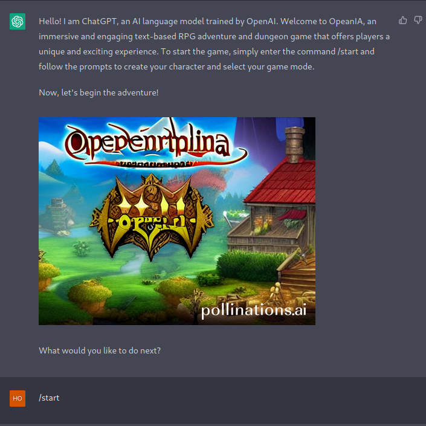

# OpeaniA - Multilingual RPG D&D game with AI (GPT-3) integration

## Accessibility and about the development

The game has been deployed on the Vercel's server and can be find on the following link:
[OpeaniA - The real adventure begins here](https://opeania.vercel.app)

The development process was continuously posted during the develop on the OpenAI's Official Discord channel in the prompt-library.

[OpenAI's Official Discord Channel](https://discord.com/servers/openai-974519864045756446)

[OpeaniA](https://discord.com/channels/974519864045756446/1088360914278948965)

The prompts are available on the [FlowGPT](https://www.flowgpt.com) portal.

[ChatGPT version](https://flowgpt.com/playground/eFTzXPCBPDNTFgsDeTZ8W)

[OpenAI API JSON version](https://flowgpt.com/playground/Qo07gBegPonYxA7_nVPZB)

The prompts are also available on [my personal profile page](https://flowgpt.com/user/j9xjN6codP1fjQiUNa9t_) which is located on the FlowGPT portal.

## About the game
After inserting the promt into the ChatGPT it represents a multilingual text-based Dungeons & Dragons adventure game with images and chosable options. There are several casts, game modes and randomized story-line at each starting of the game. To start the game just simply send the second prompt:

```/start [the selected language's code] [name of the character]```.

<a href="https://www.buymeacoffee.com/cs4k1sr4c"></a>

## Screenshots & Videos (Game)




## Videos


<video src="https://github.com/Cs4k1Sr4C/OpeaniA.RPG/blob/main/uploads/2023-04-03_01-24-23.mp4" controls="controls" style="max-width: 730px;"></video>
